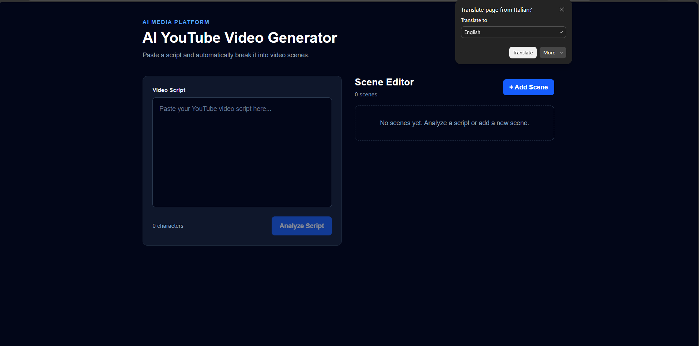
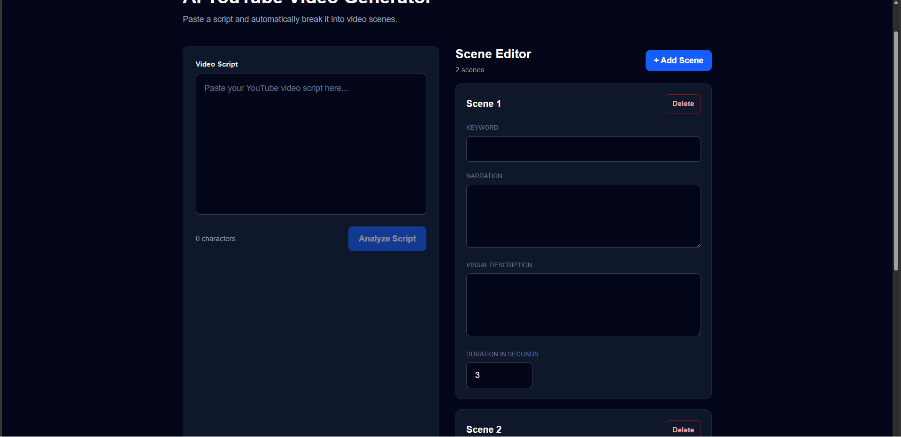

# 🎬 AI YouTube Video Generator

> An AI-powered web application that transforms a script into an editable storyboard for YouTube video creation.


---

## 📖 About

AI YouTube Video Generator is a full-stack web application that helps content creators convert a script into an editable storyboard before generating a complete AI-powered video.

The application analyzes a script, breaks it into scenes, and allows users to edit narration, visual descriptions, keywords, and durations before the video generation process.

This project is currently under active development as part of my software engineering portfolio.

---

# ✨ Current Features

### 📝 Script Analyzer

- Paste a script
- Analyze script into multiple scenes
- Automatic scene segmentation

### 🎬 Scene Editor

- ✏️ Edit narration
- 🎨 Edit visual description
- 🏷️ Edit search keywords
- ⏱️ Edit estimated duration
- ➕ Add scenes
- 🗑️ Delete scenes
- 📄 Duplicate scenes
- ⬆️ Move scenes up
- ⬇️ Move scenes down

### 🔌 Backend API

- FastAPI REST API
- Pydantic validation
- Modular backend architecture

---

# 🛠 Tech Stack

## Frontend

- React
- TypeScript
- Vite
- CSS

## Backend

- FastAPI
- Python
- Pydantic

## Development Tools

- Git
- GitHub
- VS Code

---

# 📸 Screenshots

## Dashboard




---

## Scene Editor




---

# 📂 Project Structure

```text
youtube-ai-generator
│
├── backend
│   ├── routers
│   ├── schemas
│   ├── services
│   ├── main.py
│   └── requirements.txt
│
├── frontend
│   ├── src
│   │   ├── components
│   │   ├── pages
│   │   ├── services
│   │   └── types
│   │
│   ├── package.json
│   └── vite.config.ts
│
└── README.md
```

---

# 🚀 Getting Started

## Clone the repository

```bash
git clone https://github.com/iancarlogv21/youtube-ai-generator.git
```

## Backend

```bash
cd backend

python -m venv .venv

# Windows
.venv\Scripts\activate

pip install -r requirements.txt

uvicorn main:app --reload
```

Backend will run at:

```
http://127.0.0.1:8000
```

Swagger API Documentation:

```
http://127.0.0.1:8000/docs
```

---

## Frontend

```bash
cd frontend

npm install

npm run dev
```

Frontend will run at:

```
http://localhost:5173
```

---

# 🗺 Development Roadmap

##  Sprint 1 — Foundation

- Project setup
- React + TypeScript
- FastAPI backend
- REST API
- Script Analyzer

---

##  Sprint 2 — Scene Editor

- Edit Scene
- Add Scene
- Delete Scene
- Duplicate Scene
- Reorder Scene
- Component Refactoring

---

## 🚧 Sprint 3 — AI Scene Generation (Current)

- OpenAI Integration
- AI Storyboard Generation
- Better Visual Descriptions
- Smarter Keywords

---

## 📅 Future Plans

- 🎥 Stock Video Search (Pexels)
- 🖼 AI Image Generation
- 🎙 AI Voice Generation
- 🎞 Timeline Editor
- ✂️ FFmpeg Video Rendering
- 📝 Subtitle Generation
- 📤 Export MP4
- 🔐 User Authentication
- ☁ Cloud Deployment

---

# 🏗 Architecture

```text
Script
    │
    ▼
FastAPI Backend
    │
    ▼
Scene Analyzer
    │
    ▼
Scene Editor
    │
    ▼
Media Search
    │
    ▼
Voice Generation
    │
    ▼
FFmpeg
    │
    ▼
Export MP4
```

---

# 🎯 Learning Goals

This project is being developed to strengthen my skills in:

- Full-Stack Web Development
- React
- TypeScript
- FastAPI
- REST API Design
- AI Application Development
- Software Architecture
- Git & GitHub

---

# 👨‍💻 Author

**Ian Carlo Ventura**

Bachelor of Science in Information Technology (BSIT)

City College of San Fernando, Pampanga

GitHub: 

---

# ⭐ Project Status

🚧 **Currently in Active Development**

The project is continuously being improved as new AI features are implemented.

